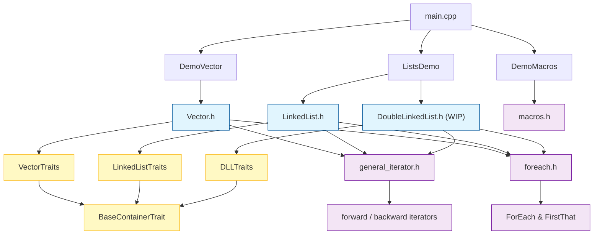

# CLAUDE.md

This file provides guidance to Claude Code (claude.ai/code) when working with code in this repository.

## Build & Run

```bash
# Build
g++ -std=c++2b main.cpp vector.cpp macros.cpp -o main

# Run
./main
```

There is no test framework — demos are functions called directly from `main()`. To run a specific demo, uncomment the relevant call in `main.cpp` (e.g., `DemoVector()`, `DemoConcurrentVector()`, `DemoMacros()`).




## Architecture

This is a C++23 educational data structures project (MCC001-AED, 2026-I). The codebase incrementally builds generic, thread-safe containers following a Traits-based design pattern.

### Core Abstractions

**Traits pattern** — containers are parameterized by a Traits struct (e.g., `VectorTraits<T>`) that bundles `value_type` and `Node` type aliases. This decouples the container from the element type and allows swapping node implementations without changing the container class.

**Node types** — `VectorNode<Traits>` holds `m_data` (the element) and `m_ref` (a `long` reference/index). Each node supports `operator++`, `operator+=`, `GetData()`, `GetDataRef()`, and `ToString()`.

**Iterator hierarchy** — `general_iterator<Container, IteratorBase>` (in `general_iterator.h`) is a CRTP base that holds a `Container*` and `Node*`. Concrete iterators (`vector_forward_iterator`, `vector_backward_iterator`) inherit from it and only override `operator++` (incrementing or decrementing the pointer).

**ForEach / FirstThat** — free function templates in `foreach.h` that accept iterator pairs and a callable with variadic args. Containers expose `ForEach`, `ReverseForEach`, `FirstThat`, and `ReverseFirstThat` as member templates that delegate to these free functions.

**Thread safety** — `Vector` uses a `std::mutex` with `scoped_lock` in `push_back`, `resize`, and `ToString`. `LinkedList` uses `std::shared_mutex`.

### File Map

| File | Purpose |
|---|---|
| `types.h` | Common type aliases (`TI`, `TD`, `TS`, `Ref`, platform-aware `XT`) |
| `macros.h` / `macros.cpp` | Preprocessor macro examples |
| `general_iterator.h` | CRTP iterator base class |
| `foreach.h` | `ForEach` and `FirstThat` free function templates |
| `vector.h` | `VectorNode`, `VectorTraits`, `Vector` template + iterator types |
| `vector.cpp` | `DemoVector()` and `DemoConcurrentVector()` demo functions |
| `linkedlist.h` | `LLNode`, `LinkedList` template with Trait-based ordering (WIP) |
| `ListsDemo.cpp` | `LinkedListDemo()` — currently has include/type errors (WIP) |
| `main.cpp` | Entry point; comment/uncomment demo calls to choose what runs |

### Naming Conventions

- Template parameters: `Traits` for trait structs, `T` for raw element types, `Container` for the owning container, `Func`/`Args` for callables.
- Member variables: `m_` prefix (e.g., `m_data`, `m_size`, `m_pNode`).
- Public API uses PascalCase (`ForEach`, `ToString`, `GetData`); STL-compatible names use snake_case (`push_back`, `begin`, `end`).
