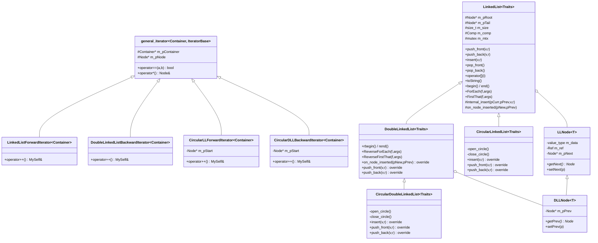

# DoubleLinkedList, CircularLinkedList y CircularDoubleLinkedList

Documentación de los nuevos contenedores agregados sobre `LinkedList<Traits>`.

## 1. Resumen

| Contenedor | Hereda de | Cambia | Recorrido |
|---|---|---|---|
| `DoubleLinkedList<Traits>` | `LinkedList<Traits>` | nodos con `m_pPrev`, agrega `BackwardIterator` | adelante y atrás |
| `CircularLinkedList<Traits>` | `LinkedList<Traits>` | invariante `tail->next = root` | circular |
| `CircularDoubleLinkedList<Traits>` | `DoubleLinkedList<Traits>` | invariante doble `tail->next = root`, `root->prev = tail` | circular en ambas direcciones |

Todo el código pesado vive en `LinkedList`. Las clases derivadas:

- **Reutilizan**: destructor, `internal_insert`, `insert` (vía hook `on_node_inserted`), `operator[]`, `toString`, `operator<<`, `operator>>`, `ForEach`, `FirstThat`.
- **Adaptan** mediante `override`: `push_back`, `push_front` (las dos subclases circulares reusan también `insert`).

## 2. Diagrama de clases (Mermaid)



## 3. Patrón de extensión: hook `on_node_inserted`

`LinkedList::internal_insert` es recursivo y desconoce el tipo concreto del nodo. Para que `DoubleLinkedList` enlace `m_pPrev` sin reescribir la lógica de inserción, `LinkedList` expone un hook virtual:

```cpp
virtual void on_node_inserted(Node* /*pNew*/, Node* /*pPrev*/) {}
```

`DoubleLinkedList` lo sobreescribe:

```cpp
void on_node_inserted(typename Base::Node *pNew, typename Base::Node *pPrev) override {
    Node* pN = static_cast<Node*>(pNew);
    Node* pP = static_cast<Node*>(pPrev);
    pN->setPrev(pP);
    if(pN->getNext() != nullptr) pN->getNext()->setPrev(pN);
}
```

Resultado: una sola implementación de `insert` para todas las variantes, y el comportamiento extra se conecta por composición.

## 4. Patrón de extensión: open/close circle

Las listas circulares tienen `tail->next == root`. El `internal_insert` de `LinkedList` recorre hasta encontrar `nullptr`, lo que en una CLL provocaría recursión infinita. Las clases circulares envuelven cada operación que reusa el código de la base con:

```cpp
open_circle();   // tail->next = nullptr (y root->prev = nullptr en CDLL)
Base::operacion();
close_circle();  // restaura la invariante circular
```

El destructor de las circulares solo necesita `open_circle()` antes de delegar a la base, que ya recorre y libera la cadena lineal.

## 5. Iteradores circulares

`CircularLLForwardIterator` y `CircularDLLBackwardIterator` heredan de `general_iterator` y guardan un `Node* m_pStart`. Su `operator++` apaga el iterador (`m_pNode = nullptr`) cuando regresa al inicio, manteniendo así el contrato `it == end() ⇔ getNode() == nullptr` que ya usa `general_iterator::operator==`.

## 6. Reutilización de operadores `<<` y `>>`

La deducción de plantillas no aplica conversiones implícitas, por lo que `cout << myDLL` no resuelve al `operator<<(ostream&, LinkedList<Traits>&)`. Cada subclase declara wrappers de una línea que delegan al de la base:

```cpp
template <typename Traits>
ostream& operator<<(ostream& os, DoubleLinkedList<Traits>& list){
    return os << static_cast<LinkedList<Traits>&>(list);
}
```

La lógica de serialización vive solo en `LinkedList` (no se duplica).

## 7. Uso

```cpp
DoubleLinkedList<AscendingDoubleLinkedListTrait<TI>> dll;
dll.insert(3, 30);
dll.insert(1, 10);
dll.insert(2, 20);
cout << dll << endl;          // [(1,10),(2,20),(3,30)]
dll.ReverseForEach(Print<DLLNode<TI>>, cout); // 3,2,1

CircularLinkedList<AscendingLinkedListTrait<TI>> cll;
cll.push_back(10, 1);
cll.push_back(20, 2);
cll.push_back(30, 3);
cll.ForEach(Print<LLNode<TI>>, cout);          // 10,20,30 — termina al cerrar el ciclo

CircularDoubleLinkedList<AscendingDoubleLinkedListTrait<TI>> cdll;
cdll.push_back(100, 1);
cdll.push_back(200, 2);
cdll.ReverseForEach(Print<DLLNode<TI>>, cout); // 200,100
```
