# Diagrama de Herencia Formal del Proyecto

Este documento describe la estructura y el diagrama de herencia formalizado de los contenedores de datos, nodos, iteradores y rasgos (traits) implementados en el proyecto.

## Diagrama de Clases UML (Mermaid)

```mermaid
classDiagram
    direction LR

    %% ==========================================
    %% CLASES: BASE SYSTEM
    %% ==========================================
    class BaseNode {
        +T m_data
        +Ref m_ref
        +GetData() T
        +SetData(T data) void
        +GetRef() Ref
        +SetRef(Ref ref) void
        +ToString() string
    }
    class BaseContainerTrait {
        +value_type
        +Node
    }
    class general_iterator {
        +Container m_pContainer
        +Node m_pNode
        +getNode() Node
    }

    %% ==========================================
    %% CLASES: NODES
    %% ==========================================
    class LLNode {
        +LLNode m_pNext
        +getNext() LLNode
        +setNext(LLNode pNext) void
    }
    class DLLNode {
        +DLLNode m_pPrev
        +getPrev() DLLNode
        +setPrev(DLLNode pPrev) void
    }
    class HeapNode {
        +size_t m_index
        +GetIndex() size_t
    }
    class VectorNode {
        +size_t m_index
        +GetIndex() size_t
    }
    class BinaryTreeNode {
        +BinaryTreeNode m_pLeft
        +BinaryTreeNode m_pRight
        +BinaryTreeNode m_pParent
        +GetLeft() BinaryTreeNode
        +GetRight() BinaryTreeNode
        +GetParent() BinaryTreeNode
    }
    class AVLTreeNode {
        +int m_height
        +GetHeight() int
        +SetHeight(int height) void
    }

    %% ==========================================
    %% CLASES: CONTAINERS
    %% ==========================================
    class LinkedList {
        +Node m_pRoot
        +Node m_pTail
        +size_t m_size
        +push_front(value) void
        +push_back(value) void
        +pop_front() pair
        +pop_back() pair
        +insert(value) void
        +size() size_t
    }
    class DoubleLinkedList {
        +rbegin() backward_iterator
        +rend() backward_iterator
    }
    class CircularLinkedList {
    }
    class CircularDoubleLinkedList {
        +getRoot() Node
        +getTail() Node
    }
    class Vector {
    }
    class Heap {
    }
    class BinaryTree {
        +Node m_pRoot
        +insert(value) void
        +inorder() range
        +preorder() range
        +postorder() range
    }
    class AVLTree {
        +Rebalance(Node node) Node
    }

    %% ==========================================
    %% CLASES: ITERATORS
    %% ==========================================
    class LinkedListForwardIterator {
        +operator++()
    }
    class DoubleLinkedListBackwardIterator {
        +operator++()
    }
    class CircularLinkedListForwardIterator {
        +operator++()
    }
    class CircularDoubleLinkedListForwardIterator {
        +operator++()
    }
    class CircularDoubleLinkedListBackwardIterator {
        +operator++()
    }
    class vector_forward_iterator {
        +operator++()
    }
    class vector_backward_iterator {
        +operator++()
    }
    class BinaryTreeInorderIterator {
        +int Direction
        +operator++()
    }
    class BinaryTreeForwardInorderIterator {
    }
    class BinaryTreeBackwardInorderIterator {
    }
    class BinaryTreeForwardPreorderIterator {
    }
    class BinaryTreeBackwardPreorderIterator {
    }
    class BinaryTreeForwardPostorderIterator {
    }
    class BinaryTreeBackwardPostorderIterator {
    }

    %% ==========================================
    %% CLASES: TRAITS
    %% ==========================================
    class BaseLinkedListTrait
    class AscendingLinkedListTrait
    class DescendingLinkedListTrait
    class BaseDoubleLinkedListTrait
    class AscendingDoubleLinkedListTrait
    class DescendingDoubleLinkedListTrait
    class BaseCircularLinkedListTrait
    class AscendingCircularLinkedListTrait
    class DescendingCircularLinkedListTrait
    class BaseCircularDoubleLinkedListTrait
    class AscendingCircularDoubleLinkedListTrait
    class DescendingCircularDoubleLinkedListTrait
    class VectorTraits
    class BaseHeapTrait
    class AscendingHeapTrait
    class DescendingHeapTrait
    class BaseBinaryTreeListTrait
    class DescendingBinaryTreeListTrait
    class AscendingAVLTreeTrait
    class DescendingAVLTreeTrait

    %% ==========================================
    %% RELACIONES DE HERENCIA Y ESTRUCTURA
    %% ==========================================
    BaseNode <|-- LLNode
    BaseNode <|-- HeapNode
    BaseNode <|-- VectorNode
    BaseNode <|-- BinaryTreeNode
    LLNode <|-- DLLNode
    BinaryTreeNode <|-- AVLTreeNode

    general_iterator <|-- LinkedListForwardIterator
    general_iterator <|-- DoubleLinkedListBackwardIterator
    general_iterator <|-- CircularLinkedListForwardIterator
    general_iterator <|-- CircularDoubleLinkedListForwardIterator
    general_iterator <|-- CircularDoubleLinkedListBackwardIterator
    general_iterator <|-- vector_forward_iterator
    general_iterator <|-- vector_backward_iterator
    
    general_iterator <|-- BinaryTreeInorderIterator
    BinaryTreeInorderIterator <|.. BinaryTreeForwardInorderIterator : "alias Direction 0"
    BinaryTreeInorderIterator <|.. BinaryTreeBackwardInorderIterator : "alias Direction 1"
    
    general_iterator <|-- BinaryTreeForwardPreorderIterator
    general_iterator <|-- BinaryTreeBackwardPreorderIterator
    general_iterator <|-- BinaryTreeForwardPostorderIterator
    general_iterator <|-- BinaryTreeBackwardPostorderIterator

    LinkedList <|-- DoubleLinkedList
    LinkedList <|-- CircularLinkedList
    DoubleLinkedList <|-- CircularDoubleLinkedList
    BinaryTree <|-- AVLTree

    LinkedList *-- LLNode : "contiene"
    DoubleLinkedList *-- DLLNode : "contiene"
    BinaryTree *-- BinaryTreeNode : "contiene"
    AVLTree *-- AVLTreeNode : "contiene"

    BaseContainerTrait <|-- BaseLinkedListTrait
    BaseLinkedListTrait <|-- AscendingLinkedListTrait
    BaseLinkedListTrait <|-- DescendingLinkedListTrait

    BaseContainerTrait <|-- BaseDoubleLinkedListTrait
    BaseDoubleLinkedListTrait <|-- AscendingDoubleLinkedListTrait
    BaseDoubleLinkedListTrait <|-- DescendingDoubleLinkedListTrait

    BaseContainerTrait <|-- BaseCircularLinkedListTrait
    BaseCircularLinkedListTrait <|-- AscendingCircularLinkedListTrait
    BaseCircularLinkedListTrait <|-- DescendingCircularLinkedListTrait

    BaseContainerTrait <|-- BaseCircularDoubleLinkedListTrait
    BaseCircularDoubleLinkedListTrait <|-- AscendingCircularDoubleLinkedListTrait
    BaseCircularDoubleLinkedListTrait <|-- DescendingCircularDoubleLinkedListTrait

    BaseContainerTrait <|-- VectorTraits

    BaseContainerTrait <|-- BaseHeapTrait
    BaseHeapTrait <|-- AscendingHeapTrait
    BaseHeapTrait <|-- DescendingHeapTrait

    BaseContainerTrait <|-- BaseBinaryTreeListTrait
    BaseContainerTrait <|-- DescendingBinaryTreeListTrait

    AscendingAVLTreeTrait ..> BaseBinaryTreeListTrait : "alias de"
    DescendingAVLTreeTrait ..> DescendingBinaryTreeListTrait : "alias de"

    LinkedList ..> BaseLinkedListTrait : "parametrizado por"
    DoubleLinkedList ..> BaseDoubleLinkedListTrait : "parametrizado por"
    BinaryTree ..> BaseBinaryTreeListTrait : "parametrizado por"
    AVLTree ..> AscendingAVLTreeTrait : "parametrizado por"
```

## Notas de Estructura y Diseño

1. **Jerarquía de Nodos**:
   - `BaseNode` es el nodo base genérico que gestiona la información (`m_data`) y la referencia (`m_ref`).
   - Los nodos especializados extienden `BaseNode`. `LLNode` agrega el puntero `m_pNext` y `DLLNode` hereda de `LLNode` y añade `m_pPrev`.
   - `BinaryTreeNode` agrega punteros a izquierda, derecha y padre para la estructura del árbol.
   - `AVLTreeNode` hereda de `BinaryTreeNode` y gestiona la altura `m_height` requerida por el balanceo AVL.

2. **Iteradores Unificados y CRTP**:
   - Los iteradores heredan de `general_iterator` bajo un diseño modular.
   - Con el último cambio, `BinaryTreeForwardInorderIterator` y `BinaryTreeBackwardInorderIterator` se han formalizado como alias/especializaciones del iterador unificado por dirección `BinaryTreeInorderIterator<Container, Direction>`.

3. **Sistema de Traits (Rasgos)**:
   - Se utiliza parametrización mediante *traits* para desacoplar los tipos de comparación (orden ascendente o descendente) y los tipos de nodo usados por cada contenedor.
